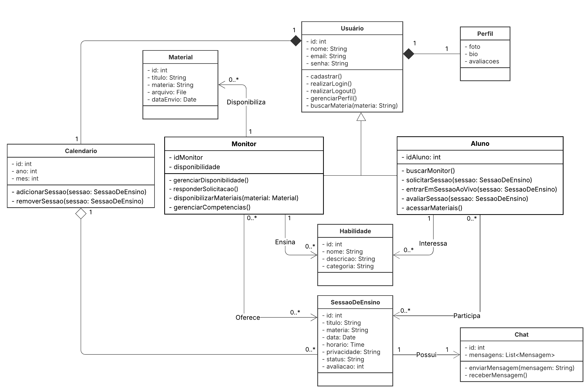

# Diagrama de Classes

## Introdução

O diagrama de classes apresentado detalha a arquitetura de um sistema para monitoria e aprendizado colaborativo. A estrutura central é baseada na interação entre diferentes classes que representam usuários, recursos e atividades do sistema. A hierarquia de classes começa com a classe 
Usuário, que possui atributos como nome, email e senha, e funcionalidades básicas como cadastrar(), realizarLogin(), e gerenciarPerfil(). O
Usuário pode ser um Monitor ou um Aluno, demonstrando uma relação de generalização/especialização. O 
Monitor oferece sessões de ensino, enquanto o Aluno participa delas e acessa materiais de apoio. A classe 
Perfil, associada a Usuário, armazena informações como foto, biografia e avaliações.

## Metodologia

A elaboração deste diagrama de classes foi realizada a partir da análise detalhada das [entidades, funcionalidades e fluxos do sistema](https://unbarqdsw2025-2-turma01.github.io/2025.2-T01-G8_Sei-PossoEnsinar_Entrega_01/#/Base/1.2.ArtefatoGeneralista), alinhando-se com os [artefatos](https://unbarqdsw2025-2-turma01.github.io/2025.2-T01-G8_Sei-PossoEnsinar_Entrega_01/#/Base/1.1.2.Sketch) gerados durante a fase de design, seguindo o escolhido como [Artefato Generalista](https://unbarqdsw2025-2-turma01.github.io/2025.2-T01-G8_Sei-PossoEnsinar_Entrega_01/#/Base/1.2.ArtefatoGeneralista). As classes foram identificadas com base nos requisitos apresentados, definindo-se seus atributos e métodos de forma consistente com os elementos descritos no [sketch inicial](https://unbarqdsw2025-2-turma01.github.io/2025.2-T01-G8_Sei-PossoEnsinar_Entrega_01/#/Base/1.1.2.Sketch). Além disso, os relacionamentos, como herança, agregação e associações, foram mapeados para refletir a interação entre os diferentes componentes do sistema, garantindo coerência com as estruturas visualizadas no protótipo, conforme ilustrado na Figura 1.

## Diagrama

<b>Figura 1:</b> Diagrama de Classes.

<b>Autores:</b> Anne de Capdeville e Bruno Cruz, 2025.

## Descrição das Classes

O diagrama de classes está organizado em torno das entidades principais da plataforma, focando na interação entre usuários, habilidades e sessões de ensino.

**Usuário**: Representa a entidade base para todos os membros do sistema. Possui atributos como `id`, `nome`, `email` e `senha`, e métodos para gerenciar o perfil, como `realizarLogin()`, `realizarLogout()` e `gerenciarPerfil()`. Todo Usuário contém um `Perfil` e um `Calendário`.

**Monitor**: É uma especialização do Usuário, com responsabilidades adicionais, como auxiliar alunos e disponibilizar sessões de estudo. O Monitor possui o atributo `idMonitor` e `disponibilidade`. Ele pode `gerenciarDisponibilidade()`, `responderSolicitacao()` e `disponibilizarMateriais()`. Um monitor ensina nenhuma ou mais `Habilidades`, e disponibiliza nenhum ou mais `Materiais`, além de oferecer nenhuma ou mais `Sessões de Ensino` aos alunos.

**Aluno**: Também é uma especialização do Usuário, voltado no foco de buscar auxilio de materiais, monitores ou sessões de ensino. Sua principal identificação é o atributo `idAluno`. O Aluno pode `buscarMonitor()`, `solicitarSessao()`, `entrarEmSessaoAoVivo()` e `avaliarSessao()`. Um Aluno pode ter interesse em várias `Habilidades` ou participar de várias `Sessões de Ensino`.

**Habilidade**: Descreve os conhecimentos que podem ser ensinados e aprendidos na plataforma. Seus atributos incluem `id`, `nome`, `descricao` e `categoria`. Uma `Habilidade` é disponibilizada por um `Monitor`.

**Perfil**: É um componente do Usuário, armazenando informações como `foto`, `bio` e `avaliacoes`. Um perfil tem relação de **composição** com Usuário, visto que todo usuário tem um perfil, necessariamente.

**SessaoDeEnsino**: Representa os encontros entre monitores e alunos. Possui atributos como `id`, `titulo`, `materia`, `data`, `horario`, `privacidade`, `status` e `avaliacao`. Está vinculada a um `Monitor`, pode ser associada a vários `Alunos` e possui um `Chat` exclusivo para comunicação. Também pode ser adicionada ou removida do `Calendario` do usuário.  

**Chat**: Responsável pela comunicação entre os participantes durante as sessões. Possui atributos como `id` e `mensagens`, armazenadas em uma lista. Conta com métodos como `enviarMensagem()` e `receberMensagem()`, permitindo a troca de informações em tempo real. Cada `SessaoDeEnsino` possui exatamente um `Chat` associado.  

**Material**: Representa os conteúdos de apoio disponibilizados pelos monitores. Possui atributos como `id`, `titulo`, `materia`, `arquivo` e `dataEnvio`. É disponibilizado por um `Monitor` e pode ser acessado pelos `Alunos` como complemento às `SessoesDeEnsino`.  

**Calendario**: Representa a agenda do usuário, permitindo o gerenciamento de sessões. Possui atributos como `id`, `ano` e `mes`, além de métodos como `adicionarSessao()` e `removerSessao()`. Cada `Usuario` possui exatamente um `Calendario`, em uma relação de composição.  

## Referências

> UML-DIAGRAMS.ORG. **Class Diagrams Overview**. Disponível em: <https://www.uml-diagrams.org/class-diagrams-overview.html>. Acesso em: 21 set. 2025.

> SERRANO, Milene. **05b - VideoAula - DSW-Modelagem - Diagrama de Classe**. 2020. Vídeo. Disponível em: <https://unbbr-my.sharepoint.com/personal/mileneserrano_unb_br/_layouts/15/stream.aspx?id=%2Fpersonal%2Fmileneserrano_unb_br%2FDocuments%2FArqDSW%20-%20V%C3%ADdeosOriginais%2F05b%20-%20VideoAula%20-%20DSW-Modelagem%20-%20Diagrama%20de%20Classe%2Emp4&nav=eyJyZWZlcnJhbEluZm8iOnsicmVmZXJyYWxBcHAiOiJTdHJlYW1XZWJBcHAiLCJyZWZlcnJhbFZpZXciOiJTaGFyZURpYWxvZy1MaW5rIiwicmVmZWJyYWxBcHBQbGF0Zm9ybSI6IldlYiIsInJlZmVycmFsTW9kZSI6InZpZXcifX0&ga=1&referrer=StreamWebApp%2EWeb&referrerScenario=AddressBarCopied%2Eview%2E8bd8aff0-8328-44b8-858b-4d8bcb855781>. Acesso em: 21 set. 2025.

> Artefato Generalista. Disponível em: <https://unbarqdsw2025-2-turma01.github.io/2025.2-T01-G8_Sei-PossoEnsinar_Entrega_01/#/Base/1.2.ArtefatoGeneralista>. Acesso em: 21 set. 2025.

> Sketch. Disponível em: <https://unbarqdsw2025-2-turma01.github.io/2025.2-T01-G8_Sei-PossoEnsinar_Entrega_01/#/Base/1.1.2.Sketch>. Acesso em: 21 set. 2025.

> Prototype. Disponível em: <https://unbarqdsw2025-2-turma01.github.io/2025.2-T01-G8_Sei-PossoEnsinar_Entrega_01/#/Base/1.1.4Prototype>. Acesso em: 21 set. 2025.

## Histórico de Versões

| Versão | Data       | Descrição                                                                                            | Autor(es)                                          | Revisor(es)                                        |
| ------ | ---------- | ---------------------------------------------------------------------------------------------------- | -------------------------------------------------- | -------------------------------------------------- |
| 1.0    | 21/09/2025 | Criação do documento e Introdução                                                                    | [Anne de Capdeville](https://github.com/nanecapde) |        [Bruno Cruz](https://github.com/brunocrzz)                                            |
| 1.1    | 21/09/2025 | Adição do Diagrama; Descrição das classes: Usuário, Monitor, Aluno, Habilidade e Perfil; Referências | [Bruno Cruz](https://github.com/brunocrzz)         | [Anne de Capdeville](https://github.com/nanecapde) |
| 1.2   | 21/09/2025 | Descrição das classes: Sessão de Ensino, Chat, Material e Calendário |  [Anne de Capdeville](https://github.com/nanecapde)         | [Bruno Cruz](https://github.com/brunocrzz) |
| 1.3    | 22/09/2025 | Melhor descrição com links. | [Anne de Capdeville](https://github.com/nanecapde) | [Bruno Cruz](https://github.com/brunocrzz)  |