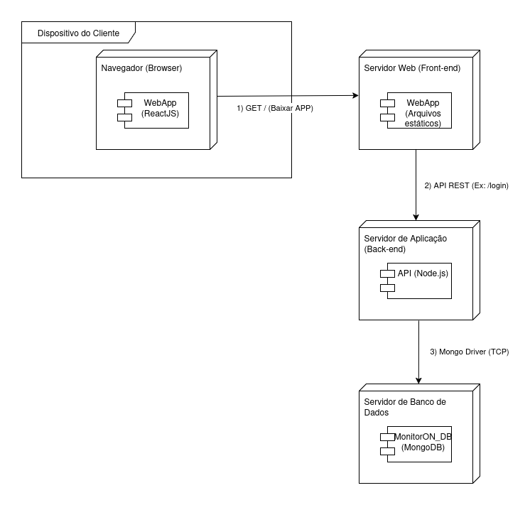

# 2.1.2. Diagrama de Implantação

## Introdução

O diagrama de implantação da UML (Unified Modeling Language) é uma ferramenta visual essencial para descrever a arquitetura física de um sistema. Ele detalha como os componentes de software são mapeados e distribuídos nos nós de hardware, oferecendo uma visão clara da topologia do sistema em produção. Este tipo de diagrama é fundamental para planejar e documentar a infraestrutura, mostrando onde cada artefato de software será executado e como os diferentes nós de hardware se comunicam.

## Objetivo

O propósito deste documento é apresentar a arquitetura de implantação planejada para o projeto **Sei&PossoEnsinar**. O diagrama serve como uma referência técnica para a equipe de desenvolvimento, facilitando o entendimento sobre como os serviços e componentes da aplicação interagem na infraestrutura. Além disso, visa alinhar a comunicação com os stakeholders sobre os requisitos de hardware e a organização do ambiente de produção.

## Metodologia

A elaboração deste diagrama seguiu os padrões da UML, utilizando a ferramenta Draw.io para a modelagem visual. O processo consistiu em identificar os principais componentes da arquitetura do **Sei&PossoEnsinar** — como a aplicação web, os servidores de front-end e back-end, e o banco de dados — e mapear sua distribuição em um ambiente de implantação típico. O diagrama ilustra as conexões e os protocolos de comunicação entre cada nó, representando o fluxo de dados desde o cliente até a camada de persistência.

## Descrição dos Componentes

## Diagrama de Implantação

<b>Figura 1:</b> Diagrama de Implantação

 

<b>Autor:</b> Atyrson Souto, 2025

## Referências

> Lucidchart. O que é UML. Disponível em: <https://www.lucidchart.com/pages/pt/o-que-e-uml>. Acesso em: 21 set. 2025.

> Edrawsoft. Exemplo de Gráfico de Implantação. Disponível em: <https://www.edrawsoft.com/pt/deployment-chart-example.html?srsltid=AfmBOookAC8MpnvlBkxL7BfAT98ctvNO35WalJjDyUo8nxIe7HZuiaNu>. Acesso em: 21 set. 2025.

## Histórico de Versões

| Versão | Data       | Descrição                               | Autor(es)                                            | Revisor(es)                                          |
| ------ | ---------- | --------------------------------------- | ---------------------------------------------------- | ---------------------------------------------------- |
| 1.0    | 21/09/2025 | Criação do documento e adicionar sessões | [Atyrson Souto](https://github.com/Atyrson)         |                                         |