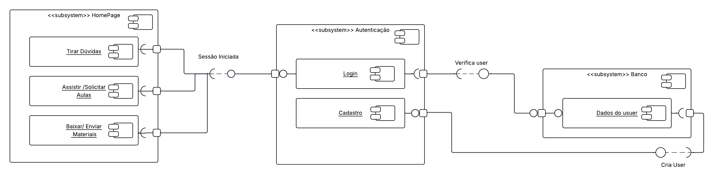

# 2.1.3. Diagrama de Componentes

## Introdução

O Diagrama de Componentes é uma das ferramentas da Linguagem de Modelagem Unificada (UML) utilizada para descrever a arquitetura de sistemas de software. Ele oferece uma visão estática da organização e das dependências entre os componentes de software, que são as partes modulares e substituíveis de um sistema. Este diagrama foca em como o sistema é dividido em blocos de construção (componentes) e como esses blocos se comunicam através de interfaces bem definidas.

## Objetivo

O principal objetivo deste diagrama é ilustrar a estrutura física e as dependências do sistema Sei&PossoEnsinar. Ele visa:

- Visualizar a arquitetura: Apresentar os principais módulos do sistema e como eles se conectam.

- Identificar dependências: Mostrar como os componentes, como a interface do usuário, o sistema de autenticação e o banco de dados, dependem uns dos outros para funcionar.

- Facilitar o desenvolvimento: Ajudar a equipe a entender a divisão de responsabilidades, promovendo um desenvolvimento mais modular e de fácil manutenção.

- Comunicar a estrutura: Servir como um documento claro para que desenvolvedores, arquitetos e outras partes interessadas compreendam a organização do software.

## Metodologia

A elaboração deste diagrama seguiu os padrões da UML, utilizando a ferramenta LucidChart para a sua criação. O processo consistiu em identificar os principais componentes da arquitetura do Sei&PossoEnsinar — como a interface principal (HomePage), o módulo de autenticação e o banco de dados — e mapear as suas interações. O diagrama ilustra as conexões e as interfaces de comunicação entre cada subsistema, representando o fluxo de dados desde a interação do usuário na página inicial até a camada de persistência de dados.

## Diagrama de Componentes

<b>Figura 1:</b> Diagrama de Componentes

 

<b>Autor:</b> João Moreira, Maria Eduarda, Pedro Camilo, Victor Camara, 2025

O Diagrama de Componentes do sistema Sei&PossoEnsinar está dividido nos seguintes subsistemas:

- HomePage: Representa a interface principal com a qual o usuário interage após ter uma sessão ativa. É o ponto de acesso para as funcionalidades centrais da plataforma. Inclui os componentes:

    - Tirar Dúvidas: Permite a comunicação para sanar questões.

    - Assistir/Solicitar Aulas: Gerencia o agendamento e a participação nas sessões de ensino.

    - Baixar/Enviar Materiais: Controla o compartilhamento de arquivos de apoio.

- Autenticação: Subsistema responsável por gerenciar o acesso dos usuários à plataforma. Ele valida as credenciais e controla o registro de novas contas, servindo como um portão de entrada para as funcionalidades restritas. Contém os componentes:

    - Login: Responsável por autenticar usuários já existentes.

    - Cadastro: Permite que novos usuários criem uma conta no sistema.

- Banco: Corresponde à camada de persistência de dados do sistema. É responsável por armazenar, recuperar e gerenciar todas as informações dos usuários de forma segura e estruturada. Inclui o componente:

    - Dados do user: Abstrai a estrutura de armazenamento das informações de perfil, credenciais e outros dados relevantes de cada usuário.

## Conclusão

O Diagrama de Componentes do sistema Sei&PossoEnsinar oferece uma representação clara e de alto nível da arquitetura do software. Ao dividir o sistema em subsistemas como HomePage, Autenticação e Banco, e ao detalhar suas interfaces de comunicação, o diagrama cumpre seu papel de documentar a estrutura modular do sistema. Essa visualização é fundamental para guiar o desenvolvimento, facilitar a manutenção e garantir que a equipe tenha um entendimento coeso sobre como as diferentes partes da plataforma se integram para entregar as funcionalidades propostas.

## Referências

> MODELOS e exemplos de diagramas UML. Lucidchart, [s.d.]. Disponível em: https://www.lucidchart.com/blog/pt/modelos-e-exemplos-de-diagramas-uml. Acesso em: 21 set. 2025.

> SERRANO, Milene. 05h - VideoAula - DSW-Modelagem - Componentes. 2020 Vídeo (Aula de Arquitetura e Desenho de Software). Disponível em: https://unbbr-my.sharepoint.com/:v:/g/personal/mileneserrano_unb_br/EQGv8dOdqHBBgYP4-KWzBD8BhDoWlC1zq0wInZIZcOm5Fg?e=TdJgXL. Acesso em: 21 set. 2025.

## Histórico de Versões

| Versão | Data       | Descrição                               | Autor(es)                                            | Revisor(es)                                          |
| ------ | ---------- | --------------------------------------- | ---------------------------------------------------- | ---------------------------------------------------- |
| 1.0    | 21/09/2025 | Criação do documento e criação do diagrama | [João Moreira](https://github.com/joaofmoreiraa), [Maria Eduarda](https://github.com/maaduh), [Pedro Camilo](https://github.com/PedrooCamilo), [Victor Camara](https://github.com/victorcamaraa)| [Yan Guimarães](https://github.com/yanzin00) |
