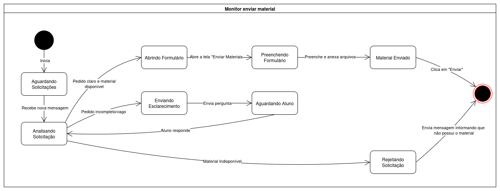

# 2.2.3. Diagrama de Estados

## Introdução

Um diagrama de máquina de estados da UML é uma ferramenta de modelagem comportamental que descreve o ciclo de vida de um único objeto. Ele é útil no desenvolvimento de software para modelar o comportamento dinâmico de classes ou sistemas, mostrando como eles reagem a eventos externos e internos. Em essência, o diagrama ilustra todos os estados possíveis de um objeto, as transições que o levam de um estado para outro e as ações que são realizadas durante essas mudanças. Isso ajuda os desenvolvedores a visualizar e projetar o fluxo lógico de um sistema, garantindo que o comportamento esperado em diferentes cenários seja compreendido e implementado corretamente.

## Metodologia

A construção do diagrama de estados foi baseada nos fluxos identificados durante o Design Sprint e nas telas mapeadas no protótipo de alta fidelidade desenvolvido para equipe. Foram mapeados os ciclos de interação do usuário com as funcionalidades de solicitar materiais, enviar material, acessar live, realizar cadastro, solicitar monitoria e adicionar disponibilidade do monitor. O diagrama foi elaborado com a ferramenta Draw.io, utilizando os símbolos padrão da UML.

## Diagrama

O diagrama de estados contém os seguintes fluxos de interação identificados como principais na plataforma MonitorON:

  
<strong>Diagrama de Estado: Solicitar Materiais</strong>

  
<b>Figura 1:</b> Diagrama de Estado - Solicitar Materiais

  

  

  
<b>Autor:</b> Atyrson Souto, 2025.

• **Solicitar Materiais**: Esse fluxo descreve o comportamento do sistema, sob a perspectiva de um aluno, ao solicitar um material de estudo para um monitor.

Inicialmente, o usuário se encontra no estado "Não Logado". Para começar, ele precisa realizar a autenticação, e o sistema transita para o estado "Navegando na Plataforma". A partir daí, o aluno acessa a área de monitores, onde pode escolher um monitor diretamente ou filtrar a busca por matéria.

Após selecionar o monitor desejado, o aluno inicia o contato para fazer seu pedido, entrando no estado "Redigindo a Solicitação". Uma vez que a mensagem é enviada, a solicitação muda para o estado central "Aguardando Resposta do Monitor". Neste ponto, o fluxo pode seguir diferentes caminhos: se o monitor envia o arquivo, o estado muda para "Material Recebido" e posteriormente para "Solicitação Concluída" após a confirmação do aluno. Se o monitor precisar de mais detalhes, o sistema entra em "Aguardando Esclarecimento do Aluno", impedindo o avanço até que o aluno responda e retorne o processo ao estado de espera pelo monitor.

Durante a espera, o aluno pode cancelar o pedido, levando a um estado final de "Solicitação Cancelada". Caso o monitor informe que não pode atender ao pedido, o fluxo é encerrado como "Solicitação Não Atendida".

  
<strong>Diagrama de Estado: Enviar Materiais</strong>

  
<b>Figura 1:</b> Diagrama de Estado - Enviar Materiais

  

  

  
<b>Autor:</b> Atyrson Souto, 2025.

**Enviar Materiais**: Este fluxo descreve o comportamento do sistema pela perspectiva do monitor ao receber e responder a uma solicitação de material feita por um aluno.

O processo se inicia com o monitor no estado "Aguardando Solicitações", disponível na plataforma para receber novos pedidos. Ao ser notificado de uma nova mensagem, o sistema transita para o estado "Analisando a Solicitação", no qual o monitor avalia o conteúdo e a viabilidade do que foi pedido.

A partir desta análise, o fluxo se divide. Se o pedido for claro e o material estiver disponível, o monitor inicia o envio, passando pelos estados "Abrindo Formulário" e "Preenchendo Formulário", onde anexa o arquivo e insere as informações necessárias. Ao confirmar, o processo chega ao estado final "Material Enviado". Caso o pedido do aluno seja vago, o monitor entra no estado "Enviando Esclarecimento" para solicitar mais detalhes. O sistema então aguarda no estado "Aguardando Aluno" e, com a resposta do estudante, retorna à etapa de "Analisando a Solicitação" para uma nova avaliação.

Por fim, se o monitor não possuir o material, ele pode encerrar o fluxo informando o aluno, o que leva ao estado "Rejeitando a Solicitação" e finaliza o processo.

## Referências

> ABDALA, Cláudio. Diagrama de estados. [S.l.]: Universidade Federal de Uberlândia. Disponível em: https://www.facom.ufu.br/~abdala/DAS5312/Diagrama%20de%20Estados.pdf. Acesso em: 18 setembro 2025

> Lucidchart. O que é um diagrama de máquina de estados UML?. Disponível em: https://www.lucidchart.com/pages/pt/o-que-e-diagrama-de-maquina-de-estados-uml. Acesso em 18 setembro 2025

## Gravação da Reunião

## Histórico de Versões

| Versão | Data       | Descrição                                                  | Autor(es)                                                                                                                                              | Revisor(es) |
| ------ | ---------- | ---------------------------------------------------------- | ------------------------------------------------------------------------------------------------------------------------------------------------------ | ----------- |
| 1.0    | 20/09/2025 | Criação do documento e adição de 2 diagramas separadamente | [Atyrson Souto](https://github.com/Atyrson)  |              |
