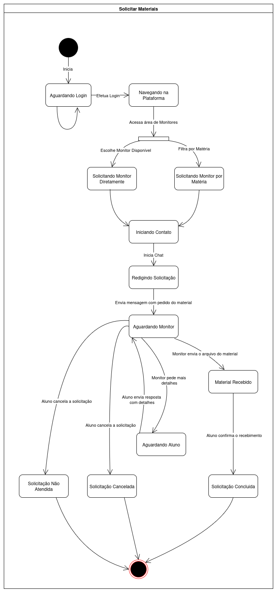
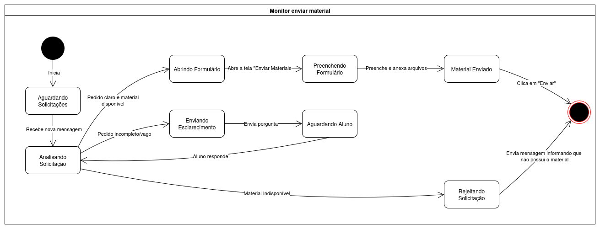

# 2.2.3. Diagrama de Estados

## Introdução

Um diagrama de máquina de estados da UML é uma ferramenta de modelagem comportamental que descreve o ciclo de vida de um único objeto. Ele é útil no desenvolvimento de software para modelar o comportamento dinâmico de classes ou sistemas, mostrando como eles reagem a eventos externos e internos. Em essência, o diagrama ilustra todos os estados possíveis de um objeto, as transições que o levam de um estado para outro e as ações que são realizadas durante essas mudanças. Isso ajuda os desenvolvedores a visualizar e projetar o fluxo lógico de um sistema, garantindo que o comportamento esperado em diferentes cenários seja compreendido e implementado corretamente.

## Metodologia

A construção do diagrama de estados foi baseada nos fluxos identificados durante o Design Sprint e nas telas mapeadas no protótipo de alta fidelidade desenvolvido para equipe. Foram mapeados os ciclos de interação do usuário com as funcionalidades de solicitar materiais, enviar material, acessar live, realizar cadastro, solicitar monitoria e adicionar disponibilidade do monitor. O diagrama foi elaborado com a ferramenta Draw.io, utilizando os símbolos padrão da UML.

## Diagrama

O diagrama de estados contém os seguintes fluxos de interação identificados como principais na plataforma MonitorON:

  
<strong>Diagrama de Estado: Solicitar Materiais</strong>

  
<b>Figura 1:</b> Diagrama de Estado - Solicitar Materiais

  

  

  
<b>Autor:</b> Atyrson Souto, 2025.

  
<strong>Diagrama de Estado: Enviar Materiais</strong>

  
<b>Figura 1:</b> Diagrama de Estado - Enviar Materiais

  

  

  
<b>Autor:</b> Atyrson Souto, 2025.

ABDALA, Cláudio. Diagrama de estados. [S.l.]: Universidade Federal de Uberlândia. Disponível em: https://www.facom.ufu.br/~abdala/DAS5312/Diagrama%20de%20Estados.pdf. Acesso em: 18 setembro 2025

Lucidchart. O que é um diagrama de máquina de estados UML?. Disponível em: https://www.lucidchart.com/pages/pt/o-que-e-diagrama-de-maquina-de-estados-uml. Acesso em 18 setembro 2025