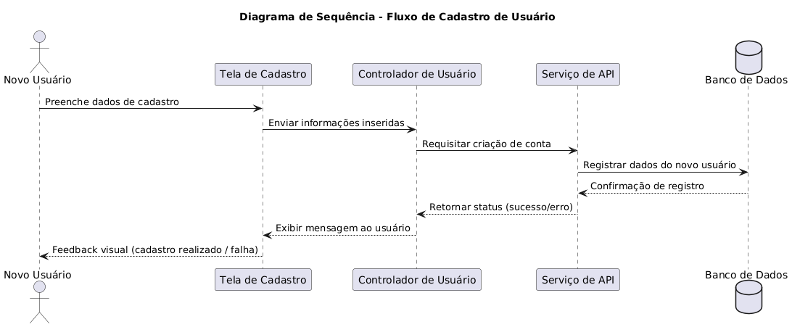
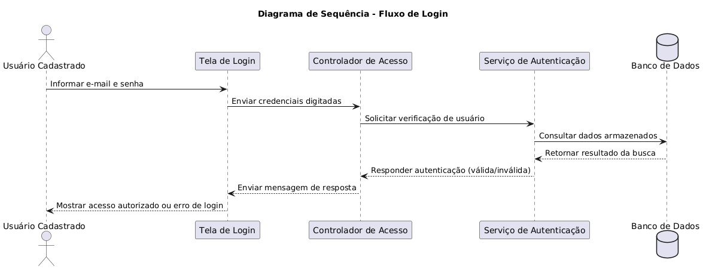
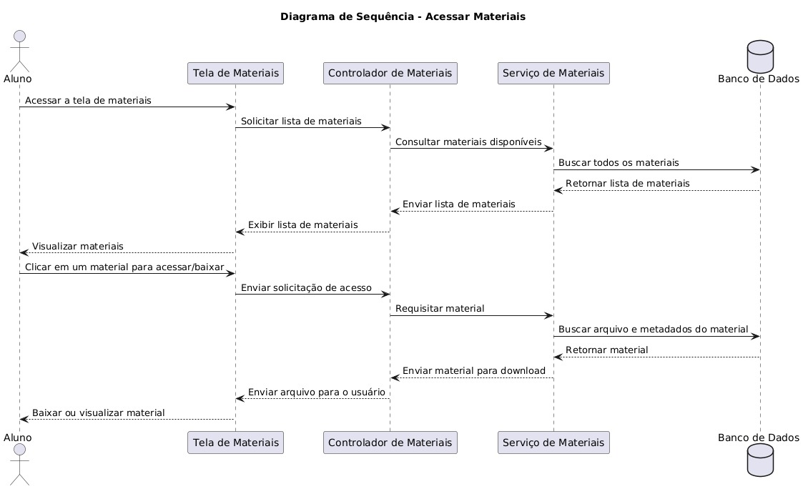
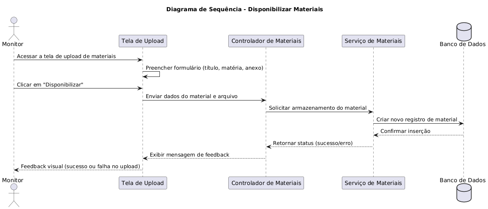
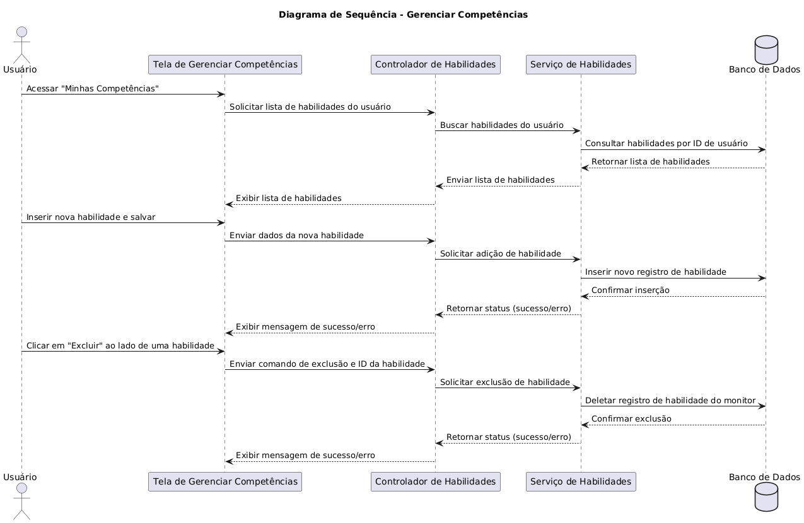
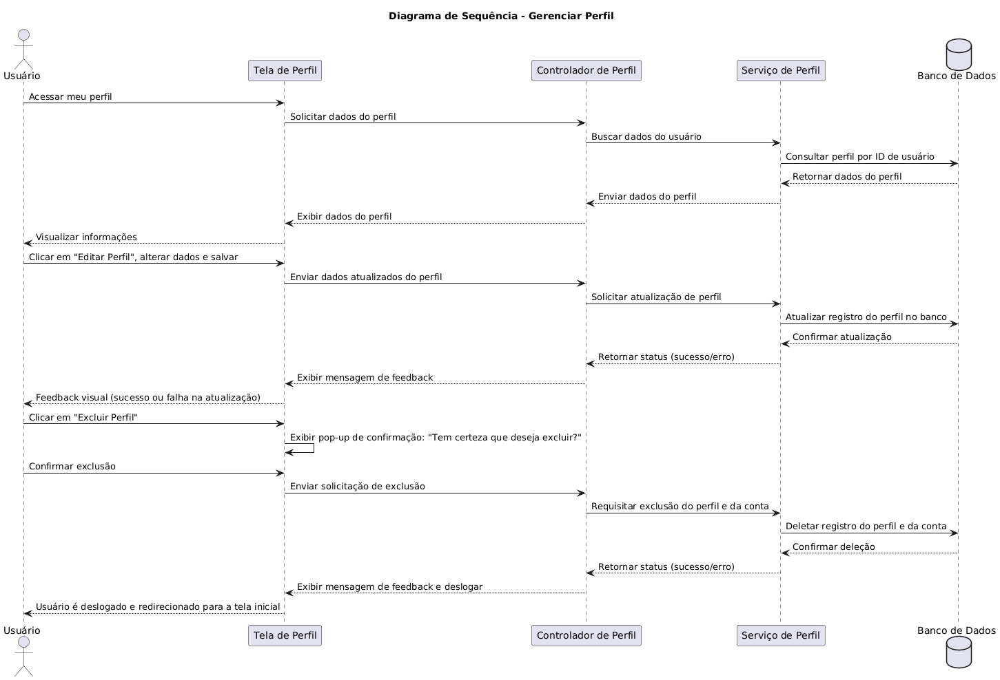
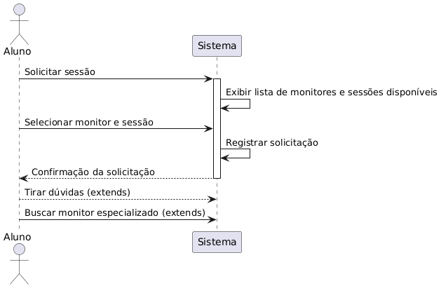
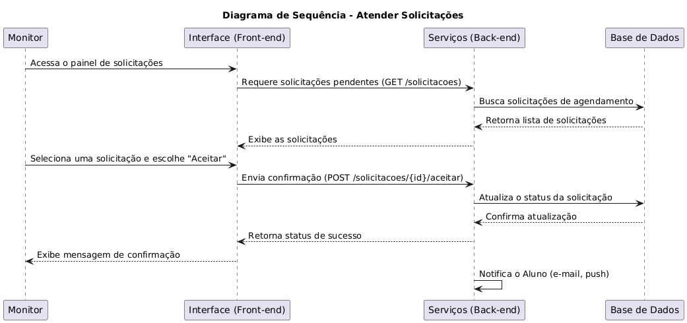
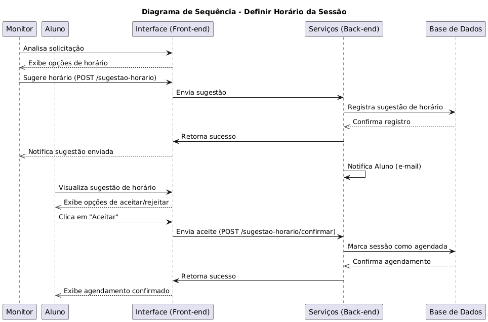
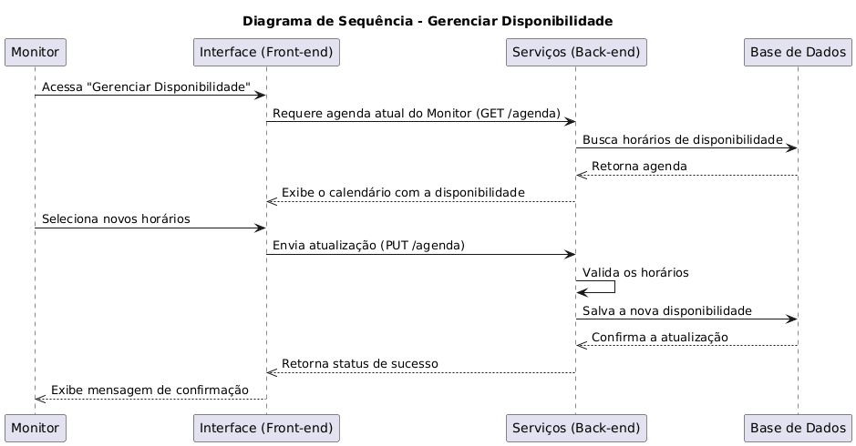

# Diagrama de Sequência

## Intrudução

O diagrama de sequência é um recurso da UML voltado para representar a comunicação entre diferentes elementos de um sistema ao longo do tempo. Ele destaca a ordem em que as mensagens são trocadas, permitindo observar a interação entre usuário, interface, serviços internos e base de dados. Esse tipo de diagrama auxilia no entendimento do funcionamento de funcionalidades específicas, já que evidencia o fluxo de execução passo a passo e as responsabilidades de cada componente envolvido. Ao estruturar essas interações, a equipe de desenvolvimento consegue antecipar possíveis inconsistências, alinhar expectativas e garantir que os processos ocorram de forma coerente com os requisitos do sistema.

## Metodologia

A elaboração dos diagramas de sequência tiveram como base os fluxos centrais representados no [Diagrama de Casos de uso](Modelagem/2.3.1.ModelagemCasosDeUso.md) do sistema, o qual evidencia as principais interações entre usuários, alunos e monitores. Foram contemplados cenários essenciais, como realizar cadastro e login, gerenciar perfil, solicitar e atender sessões de monitoria, além de funcionalidades de apoio, como acesso a materiais.

Para o desenvolvimento dos diagramas, foi utilizada a ferramenta PlantText, que permite a descrição em linguagem textual e a geração automática, por meio de códigos ,dos modelos UML. Essa abordagem assegurou consistência na padronização e clareza na representação das mensagens trocadas entre atores e componentes internos do sistema.

Assim, os diagramas de sequência não apenas detalham o comportamento dinâmico dos casos de uso apresentados, mas também fornecem uma visão precisa de como os atores interagem com o sistema em tempo de execução. Isso garante suporte tanto para a etapa de implementação quanto para futuras manutenções e evoluções do projeto.

## Diagrama de Sequência

  
<strong>Caso de uso: Cadastro</strong>

  
<b>Figura 1:</b> Diagrama de Sequência - Cadastro

  

  

  
<b>Autor:</b> Anne de Capdeville, 2025.

  O caso de uso Cadastro de Usuário descreve o processo pelo qual um novo usuário insere suas informações no sistema para criar uma conta. O fluxo tem início quando o usuário acessa a tela de cadastro e preenche os dados solicitados, como nome, e-mail e senha.
Após a inserção, essas informações são enviadas para o Controlador de Usuário, responsável por validar e encaminhar a solicitação. O controlador solicita ao Serviço de API a criação de uma nova conta.
O serviço de API registra os dados do usuário no Banco de Dados, que confirma a persistência das informações. Em seguida, o resultado da operação (sucesso ou erro) é retornado ao controlador, que exibe ao usuário uma mensagem informando se o cadastro foi concluído corretamente ou se houve falhas.
Por fim, o usuário recebe um feedback visual, garantindo transparência no processo e permitindo que ele saiba de forma imediata o status do seu cadastro. Esse fluxo assegura a integridade das informações e estabelece a base para o acesso do usuário ao sistema.

  
<strong>Caso de uso: Login</strong>

  
<b>Figura 2:</b> Diagrama de Sequência - Login

  

  

  
<b>Autor:</b> Anne de Capdeville, 2025.

  O caso de uso Login descreve o processo de autenticação do usuário no sistema, garantindo que apenas pessoas cadastradas tenham acesso às funcionalidades disponíveis.
O fluxo tem início quando o usuário cadastrado informa suas credenciais (e-mail e senha) na Tela de Login. Em seguida, essas informações são repassadas ao Controlador de Acesso, que centraliza a lógica de autenticação. O controlador solicita ao Serviço de Autenticação a verificação dos dados fornecidos.
O serviço consulta o Banco de Dados, onde estão armazenadas as informações de login dos usuários, retornando o resultado da busca. Caso as credenciais sejam válidas, o serviço envia ao controlador a confirmação de acesso, em caso contrário, uma mensagem de erro é retornada.
Por fim, a resposta é exibida ao usuário na tela: se autorizado, o acesso ao sistema é concedido, se inválido, uma notificação de falha é apresentada. Esse fluxo garante segurança, consistência na validação e controle sobre os acessos realizados no sistema.

  
<strong>Caso de uso: Acessar Materiais</strong>

  
<b>Figura 4:</b> Diagrama de Sequência - Acessar Materiais

  

  

  
<b>Autor:</b> Anne de Capdeville, 2025.

  O caso de uso Acessar Materiais descreve o processo pelo qual o aluno consulta e utiliza os conteúdos disponibilizados no sistema.
O fluxo inicia quando o aluno acessa a Tela de Materiais, que solicita ao Controlador de Materiais a lista de conteúdos disponíveis. Esse controlador, por sua vez, aciona o Serviço de Materiais, responsável por consultar o Banco de Dados em busca dos arquivos cadastrados. Após a consulta, a lista de materiais é retornada e exibida na interface para o aluno.
Em seguida, o aluno seleciona um material específico para visualização ou download. Essa ação gera uma solicitação que percorre novamente o fluxo: a tela envia o pedido ao controlador, que requisita o material ao serviço. O serviço consulta o banco, recupera o arquivo e seus metadados, e devolve os dados ao controlador.
Por fim, o material é entregue ao aluno, que pode optar por visualizá-lo diretamente na interface ou realizar o download para uso posterior. Esse processo garante organização, acesso rápido aos conteúdos e suporte ao aprendizado de forma prática e centralizada.

  
<strong>Caso de uso: Disponibilizar Materiais</strong>

  
<b>Figura 5:</b> Diagrama de Sequência - Disponibilizar Materiais

  

  

  
<b>Autor:</b> Bruno Cruz, 2025.

  O caso de uso Disponibilizar Materiais descreve o processo pelo qual o monitor insere novos conteúdos no sistema, tornando-os acessíveis aos alunos.
O fluxo tem início quando o monitor acessa a Tela de Upload de Materiais. Nessa interface, ele preenche um formulário com informações relevantes, como título, disciplina e anexo do material. Após preencher os campos necessários, o monitor confirma a ação clicando em “Disponibilizar”.
A tela envia os dados inseridos ao Controlador de Materiais, que se encarrega de validar e repassar as informações ao Serviço de Materiais. Esse serviço solicita ao Banco de Dados a criação de um novo registro para o material enviado, incluindo os metadados e o arquivo anexado. Uma vez confirmada a inserção, o banco retorna uma mensagem de sucesso.
O serviço repassa esse status ao controlador, que encaminha a resposta à tela. Por fim, o monitor recebe um feedback visual informando o resultado da operação: sucesso no upload ou falha no envio.
Esse fluxo garante que novos materiais sejam inseridos de forma organizada, controlada e com retorno imediato ao monitor sobre o status da disponibilização.

  
<strong>Caso de uso: Gerenciar Competências</strong>

  
<b>Figura 6:</b> Diagrama de Sequência - Gerenciar Competências

  

  

  
<b>Autor:</b> Bruno Cruz, 2025.

  
<strong>Caso de uso: Gerenciar Perfil</strong>

  
<b>Figura 7:</b> Diagrama de Sequência - Gerenciar Perfil

  

  

  
<b>Autor:</b> Bruno Cruz, 2025.

  
<strong>Caso de uso: Solicitar sessão de Monitoria</strong>

  
<b>Figura 3:</b> Diagrama de Sequência - Solicitar sessão de Monitoria

  

  

  
<b>Autor:</b> Anne de Capdeville, 2025.

  
<strong>Caso de uso: Atender Solicitação de sessão</strong>

  
<b>Figura 8:</b> Diagrama de Sequência - Atender Solicitação de sessão

  

  

  
<b>Autor:</b> Yan Guimarães, 2025.

  
<strong>Caso de uso: Definir horário da sessão</strong>

  
<b>Figura 9:</b> Diagrama de Sequência - Definir horário da sessão

  

  

  
<b>Autor:</b> Yan Guimarães, 2025.

  
<strong>Caso de uso: Gerenciar Disponibilidade</strong>

  
<b>Figura 10:</b> Diagrama de Sequência - Gerenciar Disponibilidade

  

  

  
<b>Autor:</b> Yan Guimarães, 2025.

## Referências

> UML Diagrams. UML sequence diagrams overview. Disponível em: https://www.uml-diagrams.org/sequence-diagrams.html. Acesso em: 21 Setembro 2025.

> Visual Paradigm – UML Sequence Diagram Tutorial. Disponível em: https://www.visual-paradigm.com/guide/uml-unified-modeling-language/what-is-sequence-diagram/ Acesso em: 21 Setembro 2025.

> Diagrama de Casos de Uso. Disponível em: [Diagrama de Casos de Uso](Modelagem/2.3.1.ModelagemCasosDeUso.md) Acesso em: 21 Setembro 2025.

## Histórico de Versões

| Versão | Data       | Descrição                                                                                          | Autor(es)                                          | Revisor(es)                                        |
| ------ | ---------- | -------------------------------------------------------------------------------------------------- | -------------------------------------------------- | -------------------------------------------------- |
| 1.0    | 21/09/2025 | Criação do documento e Diagramas de Cadastro, Login, Agendamento de Monitoria e Busca de Material. | [Anne de Capdeville](https://github.com/nanecapde) | [Yan Guimarães](https://github.com/yanzin00) |
| 1.1    | 21/09/2025 | Diagramas de Disponibilizar Materiais, Gerenciar Competências e Gerenciar Perfil.                  | [Bruno Cruz](https://github.com/brunocrzz)         | [Anne de Capdeville](https://github.com/nanecapde) |
| 1.2    | 21/09/2025 | Diagramas de Definir horário da sessão, Gerenciar Disponibilidade e Atender Solicitação de sessão. | [Yan Guimarães](https://github.com/yanzin00)        | |