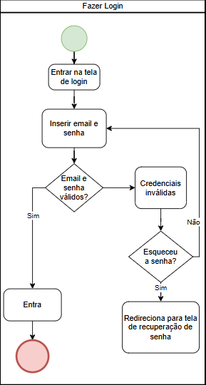
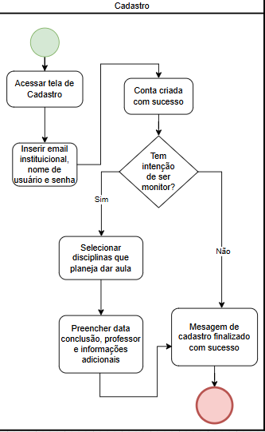
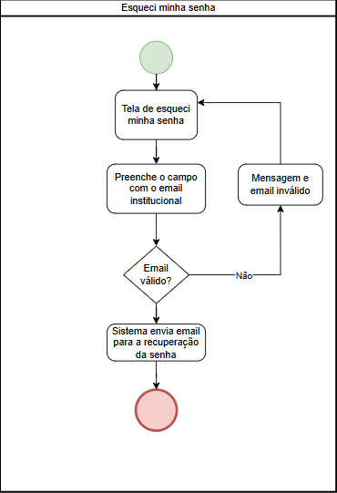
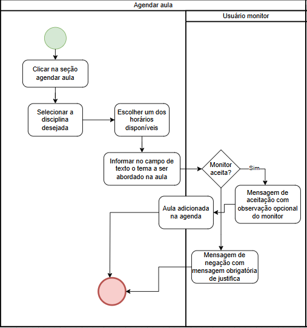
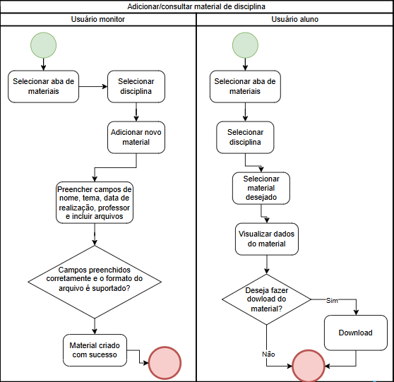
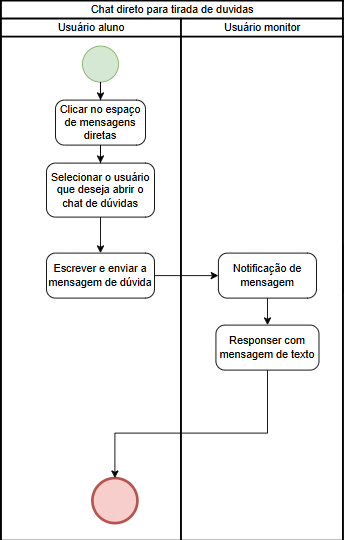
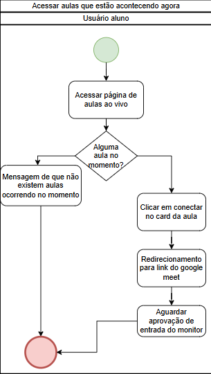

# 2.2.1. Diagramas de Atividades

## Introdução

O diagrama de atividades é um diagrama de comportamento da Linguagem de Modelagem Unificada (UML) que representa o fluxo dinâmico de processos ou atividades em um sistema. Ele é amplamente utilizado para modelar a lógica de algoritmos, processos de negócios, fluxos de trabalho ou casos de uso, promovendo uma comunicação clara entre equipes técnicas e não técnicas. 

O diagrama de atividades é especialmente útil para:
- Visualizar a sequência de ações em um processo;
- Identificar pontos de decisão e ramificações;
- Modelar atividades paralelas ou concorrentes;
- Documentar fluxos complexos para validação com partes interessadas.

## Metodologia

Para a criação deste artefato, foram definidos critérios específicos para a análise e construção dos diagramas de atividades apresentados, analisando principalmente nosso protótipo elaborado do projeto. Na sua elaboração, foi adotada a notação UML (Unified Modeling Language).

Foi utilizada a ferramenta Draw.io para a criação dos diagramas UML. Cada membro da equipe ficou responsável por desenvolver um conjunto de fluxos do sistema.

## Componentes e Notações

| Elemento                   | Descrição                                                              | Notação                                                           |
| -------------------------- | ---------------------------------------------------------------------- | ----------------------------------------------------------------- |
| **Nó Inicial**             | Marca o início do fluxo de atividades.                                 | Círculo verde preenchido.                                         |
| **Nó Final**               | Indica o término do fluxo de atividades.                               | Círculo vermelho com borda dupla.                                    |
| **Ação**                   | Representa uma tarefa ou atividade executada.                          | Retângulo com cantos arredondados.                                |
| **Fluxo de Controle**      | Define a sequência entre ações ou outros elementos.                    | Seta direcionada.                                                 |
| **Nó de Decisão**          | Representa um ponto onde o fluxo se ramifica com base em uma condição. | Losango com múltiplas saídas.                                     |
| **Nó de Fusão**            | Une fluxos alternativos provenientes de um nó de decisão.              | Losango com múltiplas entradas e uma saída.                       |
| **Barra de Sincronização** | Indica o início (fork) ou fim (join) de atividades paralelas.          | Barra horizontal ou vertical grossa.                              |
| **Swimlanes**              | Separam responsabilidades por atores ou componentes do sistema.        | Linhas verticais ou horizontais que dividem o diagrama em faixas. |

---

## Diagramas de Atividades

### 1. Login

<b>Figura 1:</b> Diagrama de Atividades - Login

  
<b>Autor:</b> João Victor, 2025.

---

### 2. Cadastro

<b>Figura 2:</b> Diagrama de Atividades - Cadastro

<b>Autor:</b> Pedro Camilo, 2025.

---

### 3. Esqueci minha senha

<b>Figura 3:</b> Diagrama de Atividades - Esqueci minha senha

<b>Autor:</b> Maria Eduarda, 2025.

---

### 4. Agendar Aula

<b>Figura 4:</b> Diagrama de Atividades - Agendar Aula

<b>Autor:</b> Pedro Camilo, 2025.

---

### 5. Adicionar/Consultar Material de Disciplina

<b>Figura 5:</b> Diagrama de Atividades - Material de Disciplina

<b>Autor:</b> João Victor, 2025.

---

### 6. Chat Direto para Tirada de Dúvidas

<b>Figura 6:</b> Diagrama de Atividades - Chat

<b>Autor:</b> Maria Eduarda, 2025.

---

### 7. Acessar Aulas ao Vivo

<b>Figura 7:</b> Diagrama de Atividades - Aulas ao Vivo

<b>Autor:</b> Pedro Camilo, 2025.

---

## Referências

> Lucidchart. _O que é um diagrama de atividades UML?_. Disponível em: <https://www.lucidchart.com/pages/pt/o-que-e-diagrama-de-atividades-uml>. Acesso em: 08/05/2025.

> ServiceNow. "O que é um diagrama de atividades?". Disponível em: [https://www.servicenow.com/br/workflows/creator-workflows/what-is-activity-diagram.html](https://www.servicenow.com/br/workflows/creator-workflows/what-is-activity-diagram.html).

## Histórico de Versões

| Versão | Data       | Descrição                                              | Autor(es) | Revisor(es) |
| ------ | ---------- | ------------------------------------------------------ | --------- | ----------- |
| 1.0    | 08/05/2025 | Criação inicial do documento e diagramas de atividades | [João Victor](https://github.com/joaofmoreiraa), [Maria Eduarda](https://github.com/maaduh), [Pedro Camilo](https://github.com/PedrooCamilo)          |             |
