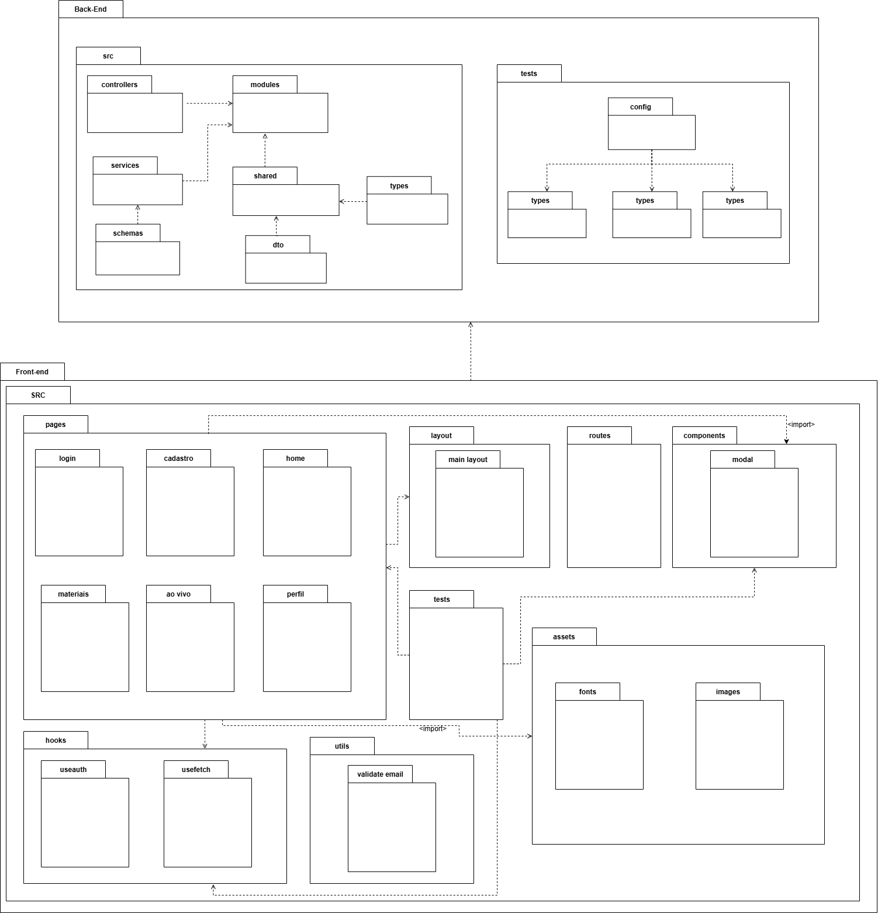
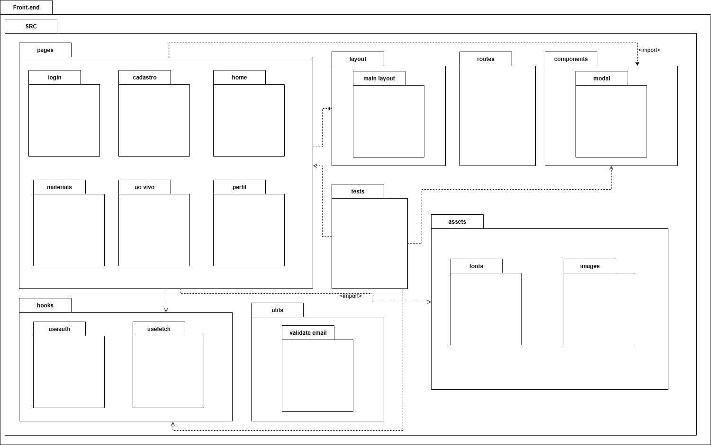
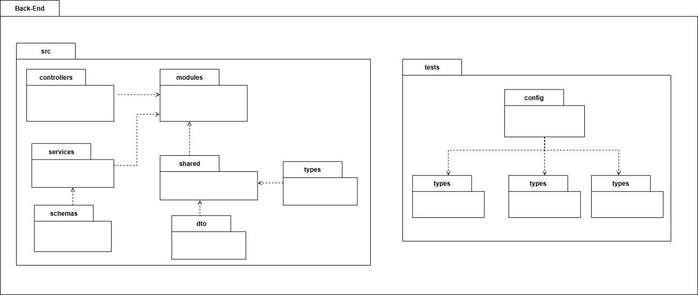

# Diagrama Organizacional

## Introdução

O sistema em desenvolvimento foi projetado com base em uma arquitetura modular, onde cada parte desempenha um papel específico e complementa os demais componentes. Essa divisão em camadas tem como propósito facilitar a escalabilidade, assegurar a manutenção contínua e aprimorar a comunicação entre os usuários e os serviços internos da aplicação. O diagrama organizacional apresentado busca demonstrar de maneira clara a estrutura do sistema, destacando como o frontend e o backend interagem para garantir a execução eficiente dos processos.

## Metodologia

A elaboração do diagrama de pacotes partiu da análise dos requisitos do sistema, priorizando a organização e a separação de responsabilidades em duas camadas principais: **Frontend e Backend**. A modelagem foi feita usando a ferramenta **Draw.io**, e o processo foi colaborativo, com a equipe se reunindo para definir a estrutura. Essa abordagem modular e a separação de escopos de trabalho garantem maior clareza arquitetural e sustentabilidade para o crescimento do sistema.

## Diagrama Organizacional

O diagrama representa a organização e a estrutura de pastas e arquivos dos dois principais pacotes do sistema:

<b>Figura 1:</b> Diagrama Organizacional

 

<b>Autores:</b> Anne de Capdeville, Bruno Cruz, Felipe Matheus, Victor Augusto, Maria Eduarda. 2025.

### Front-end

Este pacote corresponde à interface da aplicação, responsável pela interação direta com o usuário. A estrutura de pastas é organizada para agrupar componentes, páginas, rotas e a lógica de comunicação com o backend:

- **pages**: Contém os arquivos de páginas, como a de login, cadastro, home e os painéis de perfil, materiais e aulas ao vivo.

- **components:** Reúne os componentes de interface reutilizáveis, como modais e outros elementos visuais.

- **layout:** Define a estrutura principal das páginas (ex: main-layout.js).

- **routes:** Gerencia a navegação entre as diferentes páginas.

- **hooks:** Armazena a lógica de estado e controle de requisições, como os hooks de autenticação (useAuth) e de busca (useFetch).

- **utils:** Contém funções utilitárias compartilhadas, como a validação de e-mail.

- **assets:** Guarda arquivos estáticos como imagens e fontes.

<b>Figura 2:</b> Diagrama Organizacional (Front-End)

 

<b>Autores:</b> Anne de Capdeville, Bruno Cruz, Felipe Matheus, Victor Augusto, Maria Eduarda. 2025.

### Back-end

Este pacote gerencia a lógica de negócio, o processamento de dados e a comunicação com o banco de dados. Sua estrutura é dividida em módulos e camadas para garantir a organização e a manutenibilidade do código:

- **src:** A pasta principal da aplicação, onde os subsistemas de negócio são definidos.

- **controllers:** Recebe as requisições do frontend, agindo como a porta de entrada para cada funcionalidade.

- **services:** Contém a lógica de negócio da aplicação.

- **schemas:** Define a estrutura dos dados para validação e tipagem.

- **modules:** Agrupa controladores, serviços e entidades por domínio (ex: módulo de usuários, módulo de sessões).

- **shared:** Pacote para componentes compartilhados entre os módulos.

- **types e dto:** Armazenam as definições de tipos e os DTOs (Data Transfer Objects) usados na aplicação.

- **tests:** Contém a suíte de testes, organizada em testes de unit e de integration.

A estrutura modular e a separação de responsabilidades em cada pacote tornam o sistema mais claro, eficiente e escalável para futuras expansões.

<b>Figura 3:</b> Diagrama Organizacional (Back-End)

 

<b>Autores:</b> Anne de Capdeville, Bruno Cruz, Felipe Matheus, Victor Augusto, Maria Eduarda. 2025.

## Referências

> UML-DIAGRAMS.ORG. **UML Package Diagrams Overview**. Disponível em: <https://www.uml-diagrams.org/package-diagrams-overview.html>. Acesso em: 21 set. 2025.
> 
> SERRANO, Milene. **05g - VideoAula - DSW-Modelagem - Pacotes**. 2020. Vídeo. Disponível em: <https://unbbr-my.sharepoint.com/personal/mileneserrano_unb_br/_layouts/15/stream.aspx?id=%2Fpersonal%2Fmileneserrano_unb_br%2FDocuments%2FArqDSW%20-%20VídeosOriginais%2F05g%20-%20VideoAula%20-%20DSW-Modelagem%20-%20Pacotes%2Emp4&ga=1&referrer=StreamWebApp%2EWeb&referrerScenario=AddressBarCopied%2Eview%2E2743c2d7-420b-4900-b610-caf747314be2>. Acesso em: 21 set. 2025.

## Histórico de Versões

| Versão | Data       | Descrição                                                                                                   | Autor(es)                                                                                                                                                                                                                                                                            | Revisor(es)                                                                                          |
| ------ | ---------- | ----------------------------------------------------------------------------------------------------------- | ------------------------------------------------------------------------------------------------------------------------------------------------------------------------------------------------------------------------------------------------------------------------------------ | ---------------------------------------------------------------------------------------------------- |
| 1.0    | 21/09/2025 | Criação do documento; Documentação Introdução, Metodologia e início da descrição do Diagrama Organizacional | [Anne de Capdeville](https://github.com/nanecapde), [Maria Eduarda Araujo Pereira](https://github.com/maaduh), [Bruno Cruz](https://github.com/brunocrzz), [Victor Augusto de Sousa](https://github.com/victorcamaraa), [Felipe Matheus Ribeiro Lopes](https://github.com/femathrl0) | [Bruno Cruz](https://github.com/brunocrzz)                                                           |
| 1.2    | 22/09/2025 | Ajustes de erros                                                                                            | [Bruno Cruz](https://github.com/brunocrzz)                                                                                                                                                                                                                                           |                                                                                                      |
| 1.3    | 22/09/2025 | Adição de referências                                                                                       | [Bruno Cruz](https://github.com/brunocrzz)                                                                                                                                                                                                                                           |                                                                                                      |
| 1.4    | 22/09/2025 | Refatoração do Diagrama e documentação                                                                      | [Anne de Capdeville](https://github.com/nanecapde), [Maria Eduarda Araujo Pereira](https://github.com/maaduh), [Bruno Cruz](https://github.com/brunocrzz), [Victor Augusto de Sousa](https://github.com/victorcamaraa), [Felipe Matheus Ribeiro Lopes](https://github.com/femathrl0) | [Bruno Cruz](https://github.com/brunocrzz),[Maria Eduarda Araujo Pereira](https://github.com/maaduh) | 