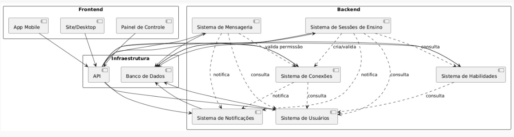

# Diagrama Organizacional

## Introdução

O sistema em desenvolvimento foi projetado com base em uma arquitetura modular, onde cada parte desempenha um papel específico e complementa os demais componentes. Essa divisão em camadas tem como propósito facilitar a escalabilidade, assegurar a manutenção contínua e aprimorar a comunicação entre os usuários e os serviços internos da aplicação. O diagrama organizacional apresentado busca demonstrar de maneira clara a estrutura do sistema, destacando como o frontend, a infraestrutura e o backend interagem para garantir a execução eficiente dos processos.

## Metodologia

A elaboração do diagrama partiu da análise dos requisitos funcionais e não funcionais do sistema, priorizando a separação por responsabilidades. Inicialmente, foi delimitado o Frontend, onde estão as interfaces de acesso dos usuários, como o aplicativo móvel, a versão web e o painel administrativo. Em seguida, definiu-se a Infraestrutura, responsável por intermediar as requisições por meio da API e assegurar o armazenamento consistente de dados no banco. Por fim, o Backend foi estruturado em subsistemas especializados, cada um dedicado a uma função central do domínio, como sessões de ensino, conexões entre usuários, habilidades, notificações e mensageria. Essa abordagem modular reduz acoplamentos, aumenta a clareza da arquitetura e possibilita o crescimento do sistema de forma sustentável.

## Diagrama Organizacional

O diagrama representa a organização e o fluxo de comunicação entre os módulos que compõem o sistema:

<b>Figura 1:</b> Diagrama Organizacional

 

<b>Autores:</b> Anne de Capdeville, Bruno Cruz, Felipe Matheus, Victor Augusto, Maria Eduarda. 2025.

### Front-end

Inclui o aplicativo móvel, a interface web e o painel de controle. Esses elementos são responsáveis pela interação direta com os usuários e enviam solicitações à camada de infraestrutura.

### Infraestutura

Abrange a API e o banco de dados. A API atua como ponte entre o frontend e os serviços do backend, enquanto o banco de dados garante a persistência e a integridade das informações.

### Back-end

Reúne sistemas especializados que asseguram o funcionamento do ambiente:
- Sistema de Usuários: administra autenticação, perfis e permissões.
- Sistema de Habilidades: concentra o gerenciamento de competências cadastradas.
- Sistema de Sessões de Ensino: controla agendamentos, validações e acompanhamento de encontros.
- Sistema de Conexões: verifica permissões e estabelece vínculos entre usuários e sessões.
- Sistema de Mensageria: viabiliza a troca de mensagens dentro da plataforma.
- Sistema de Notificações: envia alertas sobre eventos importantes, como confirmações, lembretes e atualizações.

As setas indicadas no diagrama demonstram o fluxo de dados e o relacionamento entre os módulos, representando consultas, notificações e validações. Dessa forma, o modelo organizacional torna visível a lógica estrutural do sistema e evidencia como os diferentes componentes se integram para oferecer uma solução completa e coerente.

## Histórico de Versões

| Versão | Data       | Descrição                                                                                            | Autor(es)                                          | Revisor(es)                                        |
| ------ | ---------- | ---------------------------------------------------------------------------------------------------- | -------------------------------------------------- | -------------------------------------------------- |
| 1.0    | 21/09/2025 | Criação do documento; Documentação Introdução, Metodologia e início da descrição do Diagrama Organizacional                                                                | [Anne de Capdeville](https://github.com/nanecapde) |        [Bruno Cruz](https://github.com/brunocrzz)                                            |